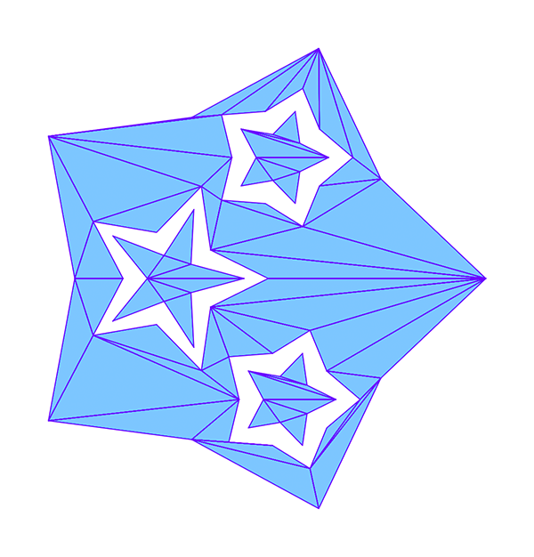

# Triangulate



An asymptotically fast triangulation package for Go.

This is in active development, and the API may change while I use it in real
projects. If you want to depend on it, you might want to make a fork for now.

# Usage

The only exported function you care about in this package is:

```go
func Triangulate(polygons ...[]Point) []Triangle
```

This takes in a list of arbitrary polygons, each specified by a slice of
`Point`s, and outputs a list of triangles. The only constraints on the polygons
in the input are:

1. Vertices of polygons must be in counterclockwise order
2. Vertices of holes must be in clockwise order
3. Line segments must not intersect, and no endpoint may lie between another
   segment's endpoints.
4. If two line segments share a point, they must be adjacent edges of the same
   polygon

None of the above constraints are checked. Violating them will cause undefined
behavior, which may or may not result in an error. Most errors will be myopic,
tending to tell you what went wrong in the internals rather than what was wrong
with your input. So it's a good idea to validate your input before passing it
in.

In addition, note that values are internally considered to be "equal" if their
difference is less than 10^-7.

Aside from the above constraints, the inputs you can give to `Triangulate` are
_very_ flexible. You can have multiple disjoint polygons, holes, polygons inside
holes, holes inside polygons inside holes, and so on. Polygons may be nonconvex
and non-monotone.

The order in which polygons occur in `list` is completely irrelevant. You can
list all the holes first, or polygon, hole, polygon, or whatever order is
convenient.

## Internals

The `internal` package exports most of its types and methods. It is not
technically part of the "public" API for this module, but it is provided for
advanced usage. Documentation of this package is inconsistent.

What you might find of particular interest in this package are:

```go
func (g *QueryGraph) AddPolygons(list PolygonList)

func (g *QueryGraph) ContainsPoint(point *Point) bool
```

These methods together allow precomputing a set of polygons to do fast hit
testing.

# Asymptotic performance

Currently, this library performs in O(nlog(n)) time. The paper on which it is
based offers a final optimization which gets this down to O(nlog\*(n)) (for any
polygon that would fit in the observable universe, log\*(n) ≤ 4), but this is
not yet implemented.

# Internals/Development

This is an implementation of
[Seidel 1991](https://www.sciencedirect.com/science/article/pii/0925772191900124),
which triangulates arbitrary simple polygons by trapezoidization. There are two
reasons this algorithm was selected:

1. It has near-linear expected time complexity, and this library is targeted at
   3D printing applications, where polygons are likely to be highly detailed.
2. Because it fundamentally operates on a pile of line segments, the algorithm
   handles holes and discontinuous polygons without any special consideration.

The outline of the entire triangulation process is as follows:

1. Build up a trapezoid adjacency graph and query graph by adding line segments
   in random order. This will give you a set of "trapezoids" (for the paper's
   extended definition of "trapezoid").
2. Postprocess the trapezoid adjacency graph by splitting any trapezoid that has
   non-adjacent vertices on its boundary. This effectively partitions the
   adjacency graph into a set of doubly linked lists of trapezoids comprising Y
   monotones.
3. Extract the Y-monotones from those partitions.
4. Convert the Y-monotones into lists of triangles and concatenate those lists.
   [This lecture](https://www.youtube.com/watch?v=pfXXgV9u6cw) gives a great
   overview of this process.

## Debugging

While the Seidel method is not terribly complicated conceptually, there are
some tricky implementation details particularly surrounding the handling of
points with equal Y values. This can make debugging fairly tricky.

Most of the internal structures have a `String` method which gives them an easy
to read random name, like "CarelessParrot". You can also get this name by
calling `dbg.Name` on any value. This function leaks memory, so it should only
be used when testing and debugging.

Several of the internal structures, `PolygonList`, `TriangleList`, and
`QueryGraph`, have a `dbgDraw(scale)` method which will render the structure to
an image and output it to the terminal. This requires the 1337 ansi code for
image embeds supported by iTerm2 and a few other terminal emulators. If you're
using another terminal, it is easy to modify these methods to output image files
instead.

When using `dbgDraw`, it can still be difficult to debug issues with Y-aligned
points, because they lead to zero-height "trapezoids". A trick for dealing with
this is to shear the points of the polygon _after_ processing, but before
drawing. Since internally, no point is ever copied (they are always treated as
pointers), this will allow you to see what's happening to the trapezoid
structure without affecting it in any other way. Just make sure you unshear
before proceeding with any further processing.

## Testing

This package has both unit tests and a set of blackbox tests using various
fixtures. These blackbox tests rely on a parallel implementation of polygon
hit-testing:

```go
func (l PolygonList) ContainsPointByEvenOdd(p *Point) bool
```

This is used to test the `QueryGraph` structure (whose primary operation is to
search for the trapezoid containing a point), the intermediate monotones, and
the final triangles, by sampling points and checking for agreement. Note that
because the test method uses the even/odd rule, which is winding-agnostic, some
care must be taken when setting up these test to ensure that its output agrees
with the winding rule used in the package.

## The nasty bits

By far the trickiest detail in this implementation is how equal Y values are
handled. A common theme in papers about triangulation is to assume that no
points will have equal Y values, and then paper over that assumption by noting
that any polygon can be rotated by some angle to meet this constraint, so no
generality is lost.

That's true.

The authors of these papers will then note as an aside that this rotation can be
simulated by a lexocographic trick, whereby given two points with equal Y values,
the left point is considered "lower". A casual reader of these papers may come
away thinking that this trick is simple and tidy.

It's not.

Theoretically, this hack is perfectly legitimate. But a naive implementor will
quickly find themselves faced with difficult geometric questions related to this
"simulated rotation". For example, how do you define whether a point on the
horizontal segment AB is "left" or "right" of that segment?

_Most_ of the work of getting this implementation working has been related to
dealing with those questions, and the best solution has generally been to dodge
them - to make sure they don't get asked in the first place. But there are cases
where I haven't yet been clever enough to dodge them, and ended up giving an
answer that appears to work empirically, but for which I can't give a compelling
theoretical justification. In fact, the apparently justifiable answer often
_doesn't_ work.

This is where undiscovered bugs are most likely to show up, and I suspect that
in some cases it will turn out that you _have_ to dodge the question, that no
concrete answer is universally valid. That's been the pattern so far.

All of that is to say: if you find a case that meets the constraints above, but
fails to triangulate, please open an issue and share the offending polygon. If
there are cases where the assumptions are bad, the only way to find them is with
counterexamples.